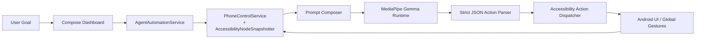
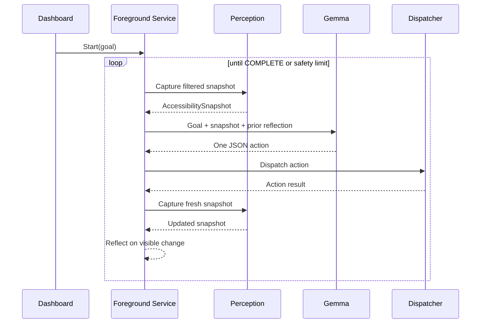
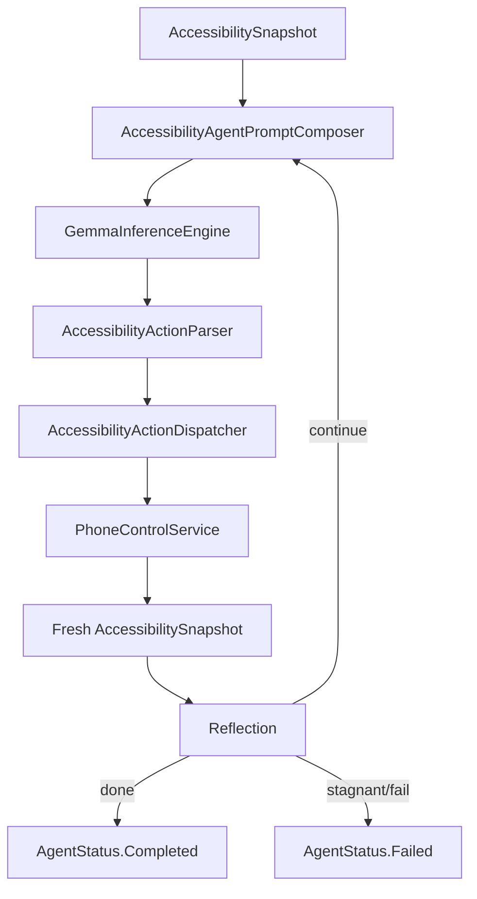

# Atlas Agent Phone Automation

## Abstract

This document describes the internal design of the Atlas Android client after the transition to an accessibility-driven, on-device agent loop. The system combines a filtered accessibility perception layer, a local MediaPipe Gemma runtime, a strict JSON action contract, and a foreground execution service that continuously verifies state changes after every action. The result is a safer and more updateable mobile agent architecture than the previous one-shot planner flow because each step is grounded in the live UI tree and validated before the next action is taken.

## 1. Introduction

Atlas is a native Android application that allows a local language model to operate the phone through the Android accessibility stack. Unlike screenshot-only approaches, this implementation uses the structured accessibility node tree as the primary perception channel. That makes the runtime lightweight enough for local inference while preserving semantic information such as labels, hints, bounds, and actionability.

Two design constraints shape the system:

1. The model must never receive the full raw UI hierarchy because token pressure and noise quickly destabilize mobile planning.
2. Every action must be verified against a fresh observation before the next decision is allowed.

## 2. System Overview



The runtime can be summarized as a closed-loop controller:

- The dashboard captures the goal and launches a foreground session.
- The accessibility service extracts and filters the live node tree.
- The prompt composer converts that tree into a bounded textual scene description.
- Gemma returns exactly one action as JSON.
- The dispatcher executes the action through gestures or text insertion.
- The loop captures a new snapshot and checks whether the UI changed.

## 3. Visual Overview

### 3.1 Dashboard Surface


The Compose dashboard is the operator console. It exposes:

- goal entry
- voice input
- model download and import controls
- loop status
- streaming execution logs

### 3.2 Runtime After Launch


The interface is intentionally separated from the background agent runtime. Once execution starts, the foreground service owns the loop and the dashboard becomes a monitoring surface rather than a direct executor.

## 4. Perception Pipeline

The perception layer is implemented in `PhoneControlService`, `AccessibilityNodeSnapshotter`, and the accessibility snapshot model classes.

### 4.1 Raw Source

Android exposes the current window through `rootInActiveWindow`. Each node contains:

- visible text
- content description
- hint text
- view ID
- actionability flags
- screen bounds

### 4.2 Filtering Strategy

The snapshotter discards high-noise content before prompting Gemma:

- invisible nodes
- zero-size nodes
- deep redundant containers
- nodes with no text, hint, ID, or actionability
- prompt content beyond node and character budget thresholds

This keeps the prompt short enough for local inference while preserving the actions the model can actually take.

### 4.3 Snapshot Encoding

Each surviving node is encoded into a compact line:

```text
[#12] depth=2 role=button label="Install" bounds=[820,1034,1002,1118] enabled=true actions=tap
```

That representation gives the model enough information to choose either:

- a node-based interaction
- a coordinate-based fallback
- a scroll or global navigation step

## 5. Planning and Prompting

Planning is now single-step and iterative instead of generating a long brittle action list up front.



The prompt contract enforces several rules:

- output must be JSON only
- only one action is allowed at a time
- destructive or unsafe actions are disallowed
- node IDs must match the visible filtered tree
- `COMPLETE` is only valid when the visible state already satisfies the goal

## 6. Execution Layer

The execution layer maps model output into Android accessibility operations.

### 6.1 Supported Actions

- `TAP`
- `SWIPE`
- `TYPE`
- `LONG_PRESS`
- `WAIT`
- `BACK`
- `HOME`
- `COMPLETE`

### 6.2 Dispatch Modes

There are two primary action modes:

1. Node-relative action
   The dispatcher resolves a node ID from the latest snapshot and uses the node center as the gesture target.
2. Coordinate fallback
   If the model cannot rely on node identity, it can provide explicit screen coordinates.

Text entry first focuses a field and then uses `ACTION_SET_TEXT`, which avoids fragile key-by-key injection.

## 7. Reflection and Safety

Reflection is the core safety improvement in this release. After every successful action, the runtime captures a fresh snapshot and checks whether one of the following changed:

- package name
- activity name
- prompt tree contents

If nothing changes repeatedly, the loop concludes that it is stuck and halts instead of blindly continuing.

Additional safeguards include:

- max step limit
- stagnant-step threshold
- model download readiness check
- accessibility-service availability check
- deterministic fast paths for known safe intents such as Wi-Fi settings and web search

## 8. Runtime Components

### 8.1 Main Components

- `MainActivity`
  Compose control surface and operator UI.
- `AgentOrchestrator`
  Entry point that keeps deterministic fast paths and delegates general app control to the foreground loop.
- `AgentAutomationService`
  Foreground service that owns background execution and notification lifecycle.
- `PhoneControlService`
  Accessibility service for both perception and gesture dispatch.
- `GemmaInferenceEngine`
  Local MediaPipe Gemma manager with GPU-preferred backend fallback.

### 8.2 Internal Data Flow



## 9. Empirical Validation

The release was validated with three gates:

- local unit tests
- emulator instrumentation tests
- release assembly of the signed APK

Instrumentation now verifies the updated activity and intent-dispatch behavior on an Android emulator instead of relying on the older XML view hierarchy.

### 9.1 Corrupt Model Recovery Validation

The runtime was additionally tested against a deliberately broken MediaPipe task bundle copied into app storage. This reproduces the class of failure that previously surfaced as a native `Unable to open zip archive` initialization error. After the 0.6.1 fix, the runtime invalidates the saved model, returns control to the dashboard, and presents a plain-language recovery message that instructs the operator to re-import or re-download a valid bundle.


## 10. Limitations

Despite the improvements, the system still has meaningful constraints:

- it depends on well-formed accessibility trees from third-party apps
- non-accessible custom canvases remain difficult to automate
- local Gemma reasoning is still bounded by token and latency limits
- screenshot-grounded visual reasoning is not part of this local path

## 11. Conclusion

This release moves Atlas from a fragile planner-centric interaction style to a more research-aligned mobile agent architecture: observe a bounded scene, choose one safe action, execute it, verify the result, and only then continue. The design is update-friendly because it uses a stable signing path, explicit versioning, a foreground execution service, and a modular runtime that can later absorb stronger models, richer verification, or screenshot fusion without discarding the current control loop.
